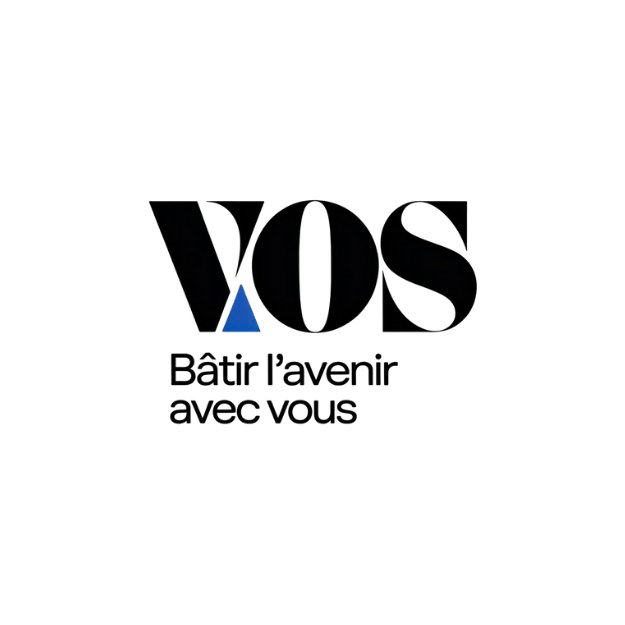

# VOS - Votre opportunite simplifiee

<p align="center">
  
  
</p>

<p align="center">
  
  
  
  
</p>

<p align="center">
  
  
  
  
</p>

VOS est une application Symfony de gestion RH et recrutement. Elle centralise les candidatures, les entretiens, les recrutements, les contrats, la generation de PDF, les notifications par email et plusieurs fonctions d'assistance par IA.

## Apercu rapide

| Module | Description |
| --- | --- |
| Candidatures | Depot, suivi, modification, export PDF et analyse |
| Entretiens | Planification, QR code public, evaluation et suivi |
| Recrutement | Decision finale, notifications et synchronisation agenda |
| Contrats | Gestion RH, rappels et suivi de fin de contrat |

## Fonctionnalites principales

- Authentification avec connexion classique et reconnaissance faciale.
- Gestion des candidatures client avec ajout, modification, suppression et export PDF.
- Gestion des offres, des criteres et des statistiques recrutement.
- Gestion des entretiens avec export PDF et QR code vers une page mobile publique.
- Gestion des contrats et rappels automatiques avant echeance.
- Envoi d'emails automatiques pour les candidatures, les contrats et les decisions.
- Amelioration et generation de contenu via Groq.
- Correction linguistique via LanguageTool.
- QR codes pour verifier ou consulter des documents rapidement.

## Stack technique

- Symfony 6.4
- PHP 8.1+
- Doctrine ORM / Migrations
- Twig
- Symfony Mailer
- Dompdf
- Endroid QR Code Bundle
- face-api.js cote navigateur
- Groq API pour les fonctions IA
- LanguageTool API pour la correction grammaticale
- Google Calendar pour certaines synchronisations

## Structure du projet

- `src/Controller` : controleurs HTTP.
- `src/Service` : services metiers, email, IA, PDF, calendrier.
- `src/Entity` : entites Doctrine.
- `src/Form` : formulaires Symfony.
- `templates` : vues Twig et templates email/PDF.
- `public` : fichiers accessibles publiquement, images, styles, uploads.
- `migrations` : migrations Doctrine.

## Installation

### 1. Installer les dependances

```bash
composer install
```

### 2. Configurer l'environnement

Copiez ou adaptez vos variables d'environnement dans `.env.local` ou `.env.dev.local`.

Variables utiles :

- `DATABASE_URL`
- `MAILER_DSN`
- `GROQ_API_KEY`
- `GROQ_MODEL`
- `APP_PUBLIC_URL`

### 3. Creer la base de donnees et executer les migrations

```bash
php bin/console doctrine:database:create
php bin/console doctrine:migrations:migrate
```

### 4. Lancer le serveur local

```bash
cd vos-symfony
php -S 127.0.0.1:8000 -t public
```

Si vous avez le Symfony CLI installe, vous pouvez aussi utiliser :

```bash
symfony serve --dir=vos-symfony --listen-ip=0.0.0.0 --no-tls
```


## Variables externes et APIs

Ce projet utilise plusieurs services externes :

- Groq pour la generation de texte IA.
- LanguageTool pour la correction linguistique.
- face-api.js charge depuis un CDN pour la reconnaissance faciale cote navigateur.
- Un transport mail configure par `MAILER_DSN`.

## Flux IA et email dans le recrutement

Le rappel de contrat suit ce principe :

1. Un command Symfony detecte les contrats proches de la date de fin.
2. `ContractReminderAiService` demande a Groq de generer un message court et professionnel.
3. `RecrutementNotificationService` envoie ensuite l'email avec le message genere.
4. Si Groq echoue, une version de secours est utilisee pour ne jamais bloquer l'envoi.

## Reconnaissance faciale

La connexion Face ID fonctionne cote navigateur avec JavaScript :

1. La camera est ouverte avec `getUserMedia`.
2. face-api.js extrait un descriptor facial.
3. Le descriptor live est compare avec la reference utilisateur.
4. Si la similarite est suffisante, le formulaire de connexion est valide.


## Contributeurs

Les identites ci-dessous viennent de `git shortlog -sne --all`, verifiees sur le depot local. Certaines personnes ont plusieurs alias Git, donc les lignes sont conservees telles qu'elles apparaissent dans l'historique.

| Contributeur Git | Commits | Branche principale observee |
| --- | ---: | --- |
| Azer-khadhraoui <azerronaldo2004@gmail.com> | 58 | `Gestion-Utilisateur` |
| MAMIYASSINE <mamiy463@gmail.com> | 32 | `Gestion-Candidat` |
| yessine merhbene <mohamedyessin.merhbene@esprit.tn> | 27 | `Gestion-Entretien`, `GESTION-ENTRETIEN-INTEG` |
| omar belhaj <obelhaj444@gmail.com> | 16 | `Gestion-Offre` |
| Fares manai <faresmanai05@gmail.com> | 10 | `Gestion-Recrutement` |


<p align="center">
  
</p>
