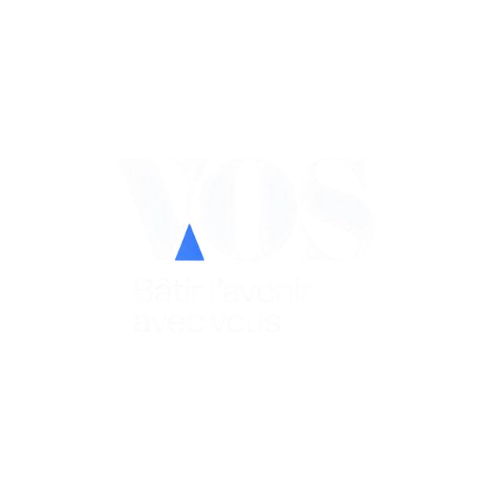

# VOS - Virtual Onboarding System

<p align="center">
  
</p>

VOS est une application Symfony de gestion RH et recrutement. Elle centralise les candidatures, les entretiens, les recrutements, les contrats, la generation de PDF, les notifications par email et plusieurs fonctions d'assistance par IA.

## Fonctionnalites principales

- Authentification avec connexion classique et reconnaissance faciale.
- Gestion des candidatures client avec ajout, modification, suppression et export PDF.
- Gestion des offres, des criteres et des statistiques recrutement.
- Gestion des entretiens avec export PDF et QR code vers une page mobile publique.
- Gestion des contrats et rappels automatiques avant echeance.
- Envoi d'emails automatiques pour les candidatures, les contrats et les decisions.
- Amelioration et generation de contenu via Groq.
- Correction linguistique via LanguageTool.
- QR codes pour verifier ou consulter des documents rapidement.

## Stack technique

- Symfony 6.4
- PHP 8.1+
- Doctrine ORM / Migrations
- Twig
- Symfony Mailer
- Dompdf
- Endroid QR Code Bundle
- face-api.js cote navigateur
- Groq API pour les fonctions IA
- LanguageTool API pour la correction grammaticale
- Google Calendar pour certaines synchronisations

## Structure du projet

- `src/Controller` : controleurs HTTP.
- `src/Service` : services metiers, email, IA, PDF, calendrier.
- `src/Entity` : entites Doctrine.
- `src/Form` : formulaires Symfony.
- `templates` : vues Twig et templates email/PDF.
- `public` : fichiers accessibles publiquement, images, styles, uploads.
- `migrations` : migrations Doctrine.

## Installation

### 1. Installer les dependances

```bash
composer install
```

### 2. Configurer l'environnement

Copiez ou adaptez vos variables d'environnement dans `.env.local` ou `.env.dev.local`.

Variables utiles :

- `DATABASE_URL`
- `MAILER_DSN`
- `GROQ_API_KEY`
- `GROQ_MODEL`
- `APP_PUBLIC_URL`

### 3. Creer la base de donnees et executer les migrations

```bash
php bin/console doctrine:database:create
php bin/console doctrine:migrations:migrate
```

### 4. Lancer le serveur local

```bash
symfony serve --dir=vos-symfony --no-tls
```

Pour un acces reseau local depuis un autre appareil, vous pouvez utiliser :

```bash
symfony serve --dir=vos-symfony --listen-ip=0.0.0.0 --no-tls
```

## Variables externes et APIs

Ce projet utilise plusieurs services externes :

- Groq pour la generation de texte IA.
- LanguageTool pour la correction linguistique.
- face-api.js charge depuis un CDN pour la reconnaissance faciale cote navigateur.
- Un transport mail configure par `MAILER_DSN`.

## Flux IA et email dans le recrutement

Le rappel de contrat suit ce principe :

1. Un command Symfony detecte les contrats proches de la date de fin.
2. `ContractReminderAiService` demande a Groq de generer un message court et professionnel.
3. `RecrutementNotificationService` envoie ensuite l'email avec le message genere.
4. Si Groq echoue, une version de secours est utilisee pour ne jamais bloquer l'envoi.

## Reconnaissance faciale

La connexion Face ID fonctionne cote navigateur avec JavaScript :

1. La camera est ouverte avec `getUserMedia`.
2. face-api.js extrait un descriptor facial.
3. Le descriptor live est compare avec la reference utilisateur.
4. Si la similarite est suffisante, le formulaire de connexion est valide.

## QR code dans le PDF d'entretien

Le PDF d'entretien contient un QR code qui pointe vers une page publique mobile de consultation rapide.

## Logo du projet

Le logo VOS est stocke dans :

- `public/images/logo.png`

Il est reutilise dans les documents PDF, les emails et ce README.

## Notes de configuration

- Ne pas versionner vos secrets reels dans le depot.
- Verifier que `APP_PUBLIC_URL` correspond a l'adresse accessible depuis votre reseau.
- Pour la faciale, le navigateur doit autoriser la camera.
- Pour les emails, verifier le transport SMTP ou le provider configure dans `MAILER_DSN`.

## Auteurs

Projet VOS - Virtual Onboarding System

## Contributeurs

Les identites Git ci-dessous apparaissent dans l'historique du projet. Certaines personnes utilisent plusieurs alias de commit, donc la liste conserve les noms tels qu'ils sont visibles dans Git.

| Contributeur Git | Commits | Branche principale observée |
| --- | ---: | --- |
| Azer-khadhraoui <azerronaldo2004@gmail.com> | 31 | `main`, `Gestion-Utilisateur` |
| Mohamed azer khadhraoui <azerronaldo2004@gmail.com> | 4 | `main` |
| MAMIYASSINE <mamiy463@gmail.com> | 31 | `Gestion-Candidat`, `Gestion-Recrutement` |
| yessine merhbene <mohamedyessin.merhbene@esprit.tn> | 25 | `Gestion-Entretien`, `GESTION-ENTRETIEN-INTEG` |
| omar belhaj <133699793+wrldomar@users.noreply.github.com> | 13 | `Gestion-Offre` |
| TanSuperNova <faresmanai05@gmail.com> | 6 | `main` |
| Yassine Mami <126829473+MAMIYASSINE@users.noreply.github.com> | 3 | Alias historique de `MAMIYASSINE` |
| Yessine Merhbene <168140906+yessinemer@users.noreply.github.com> | 2 | Alias historique de `yessine merhbene` |
| Fares Manai <faresmanai05@gmail.com> | 1 | `main` |

Equipe VOS.